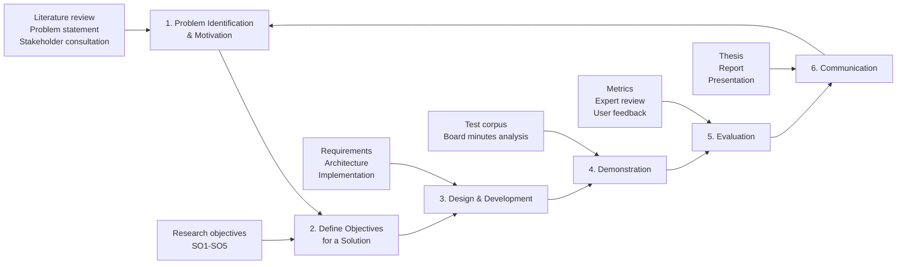
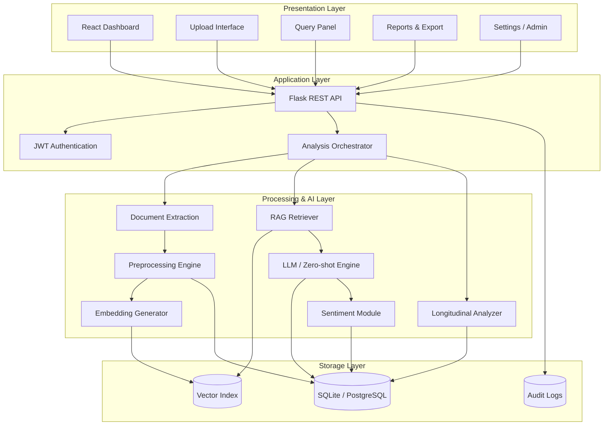
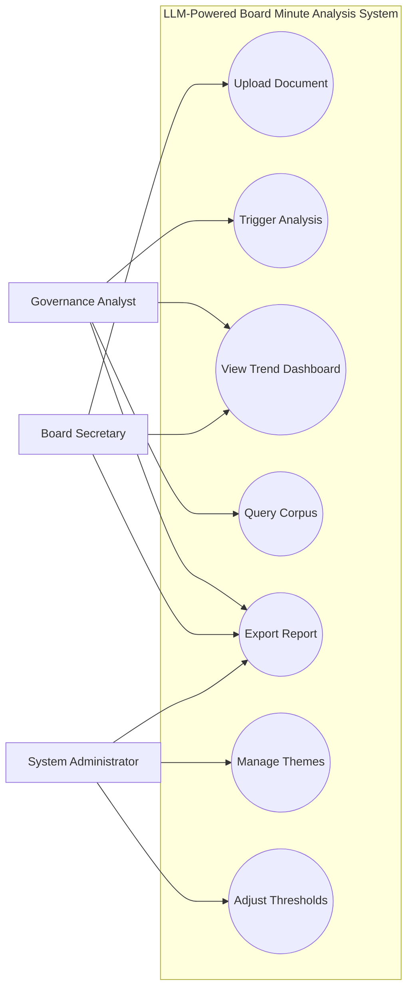
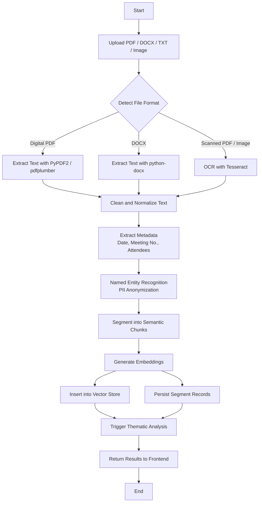
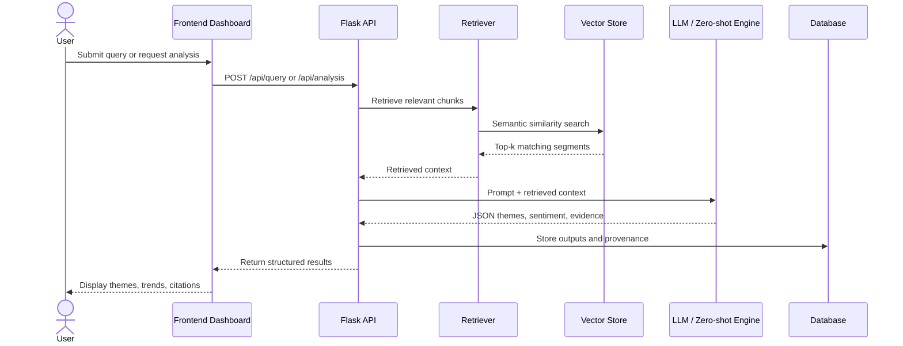
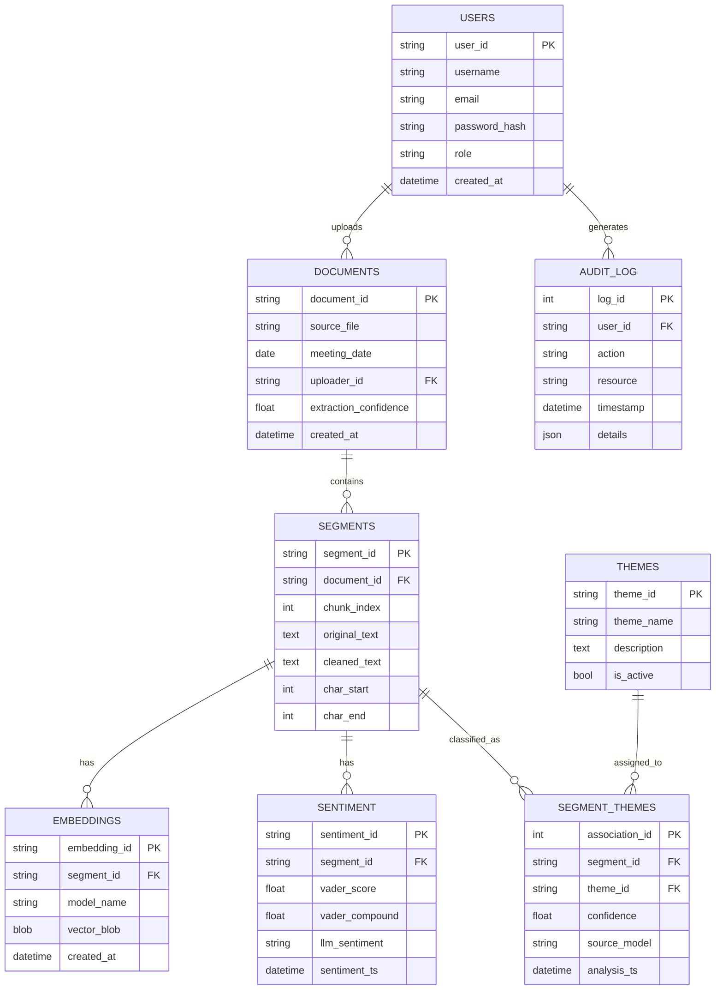
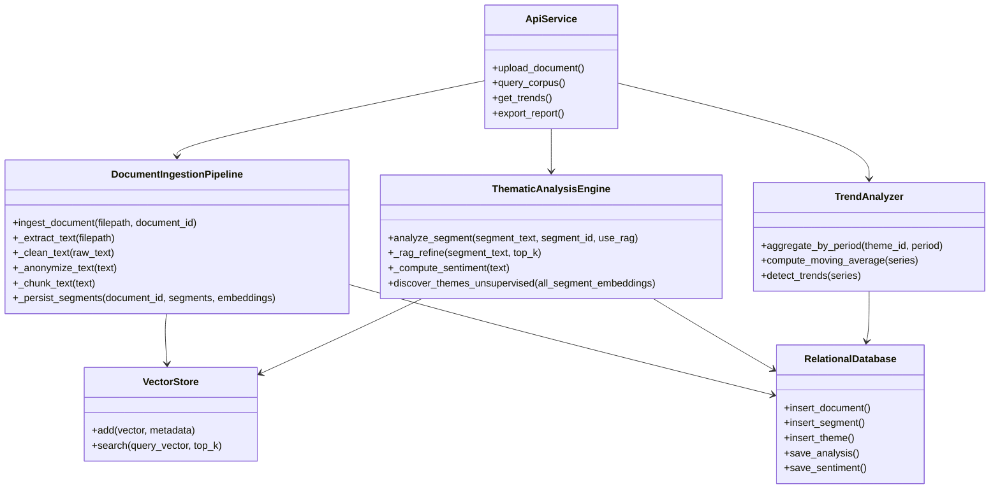
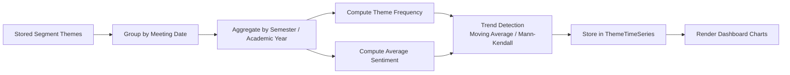
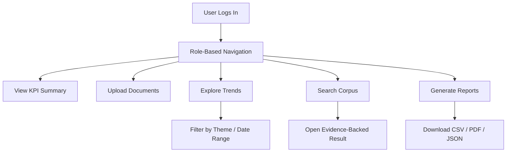
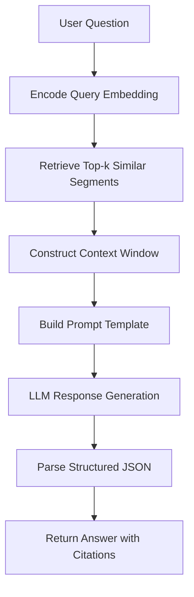

# Chapter 3 Mermaid Diagrams

Use these Mermaid diagrams directly in your thesis draft or convert them into images for figure insertion.

## Figure 3.1 - DSR Process Model

## Figure 3.2 - Overall System Architecture

## Figure 3.3 - Use Case Diagram

## Figure 3.4 - Document Ingestion and Preprocessing Flow

## Figure 3.5 - LLM Thematic Extraction Sequence Diagram

## Figure 3.6 - ER Diagram

## Figure 3.7 - Class Diagram for Core Processing Components

## Figure 3.8 - Longitudinal Analysis Workflow

## Figure 3.9 - Dashboard Interaction Flow

## Figure 3.10 - RAG Query Processing Flow

## Suggested Caption Style

- Figure 3.1 - DSR Process Model for the Study
- Figure 3.2 - Overall Architecture of the LLM-Powered Board Minute Analysis Framework
- Figure 3.3 - Use Case Diagram for Core Users and System Functions
- Figure 3.4 - Document Ingestion and Preprocessing Pipeline
- Figure 3.5 - Sequence Diagram of LLM-Based Thematic Extraction and RAG Querying
- Figure 3.6 - Entity-Relationship Diagram of the System Database
- Figure 3.7 - Class Diagram of Core Processing Modules
- Figure 3.8 - Workflow for Longitudinal Trend Analysis
- Figure 3.9 - Dashboard Interaction Flow
- Figure 3.10 - Retrieval-Augmented Generation Query Flow
