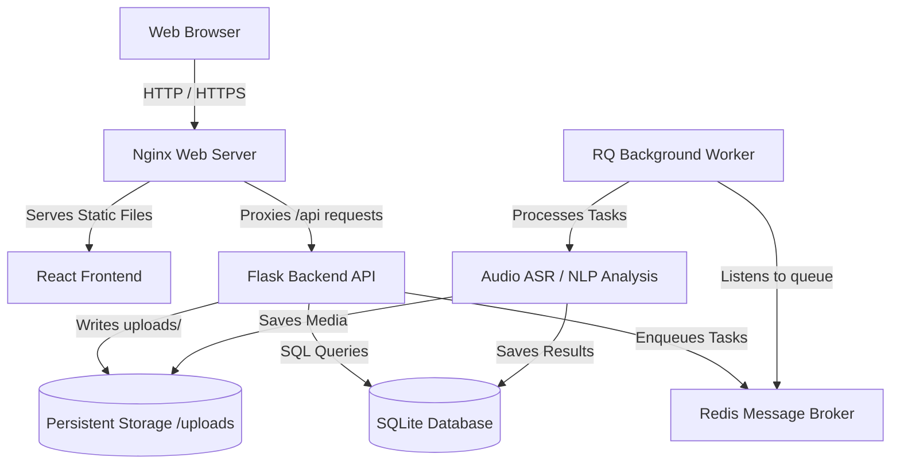

# ITDS Framework Deployment & Hosting Guide

This guide provides step-by-step instructions for hosting the ITDS Framework in a production environment. Since the application includes React, Flask, Redis, background task workers, OCR engines, audio decoders, and local machine learning models, deploying it requires a properly structured pipeline.

---

## 1. Architecture Overview

In a production environment, the application is divided into five main components:



1. **Nginx**: Serves the compiled React frontend, routes `/api/` traffic to the backend, and handles SSL termination.
2. **Flask Backend**: The REST API which runs under a WSGI server (**Gunicorn**).
3. **RQ Worker**: A Python process running background tasks (ASR transcription, Named Entity Recognition, Summarization, etc.).
4. **Redis**: The message broker used by the Flask backend and RQ Worker.
5. **SQLite & Storage**: Local filesystem-based persistence for the database and uploaded media assets (audios, images, DOCX/PDF documents).

---

## 2. Server Specifications & Prerequisites

### Minimum Hardware Requirements
Because this application runs heavy local Hugging Face transformer models (such as `bart-large`, `deberta-v3-base`, `bert-large`, and `whisper-tiny`), the host machine has specific memory requirements:
* **Without GPU (CPU Only)**: Minimum **8 GB RAM** (16 GB highly recommended) with a quad-core CPU. Make sure to configure swap memory (at least 4 GB) to prevent Out-Of-Memory (OOM) crashes.
* **With GPU (Recommended)**: An NVIDIA GPU with at least **8 GB VRAM** (e.g., AWS `g4dn.xlarge`, or a dedicated server with a T4, A10G, or RTX 3060/4060). Ensure CUDA drivers are installed on the host.

---

## 3. Option A: Containerized Deployment (Docker Compose) - *Recommended*

This is the fastest, most isolated, and recommended way to deploy the ITDS Framework. We have created a `Dockerfile` for the Python services, a `Dockerfile` for the frontend, and a `docker-compose.yml` to stitch them together.

### Step 1: Prepare Environment Variables
Create a production `.env` file in your workspace directory (you can clone your existing `.env` file). Ensure that all production-specific variables are filled in:

```ini
# Security (Ensure these are strong, random strings of 32+ characters)
SECRET_KEY=generate-a-very-long-secure-random-key-here
JWT_SECRET_KEY=generate-another-long-secure-random-key-here

# Redis broker URL (In Docker Compose, the redis container hostname is 'redis')
REDIS_URL=redis://redis:6379/0

# API Keys (Enable cloud-assisted summaries or translation)
GEMINI_API_KEY=your-gemini-key
OPENAI_API_KEY=your-openai-key
HF_TOKEN=your-huggingface-token-if-needed

# Email Configuration (for automated email reports)
SMTP_SERVER=smtp.gmail.com
SMTP_PORT=587
SMTP_USERNAME=your-email@gmail.com
SMTP_PASSWORD=your-gmail-app-password
FROM_EMAIL=your-email@gmail.com

# Web Push Notification configuration
VAPID_PUBLIC_KEY=your-vapid-public-key
VAPID_PRIVATE_KEY=your-vapid-private-key
VAPID_SUBJECT=mailto:your-email@gmail.com
```

### Step 2: Warm up the AI Models (Pre-caching)
To avoid server timeout issues when first executing ASR or NLP tasks, download the models before booting the main container. Run this command on your host machine inside the project directory:

```bash
# Run a temporary container to download models to the volume
docker compose run --rm backend python scripts/warm_models.py
```
This downloads all models from Hugging Face and saves them to the shared `hf_cache` Docker volume.

### Step 3: Launch the Stack
Start all services in detached mode:

```bash
docker compose up -d
```

Verify that all containers are running:

```bash
docker compose ps
```

The application will be accessible at:
* **Frontend UI**: `http://<your-server-ip>` (Port 80)
* **Backend Flask API**: `http://<your-server-ip>:5001` (Port 5001)

### Docker Volume Persistence
The Docker configuration mounts volumes to ensure your data survives container updates:
* `redis_data`: Persists the Redis message queue state.
* `backend_data`: Maps to `/data`, containing `itds_minutes.db` (database) and `/data/uploads/` (profile images and user uploads).
* `hf_cache`: Holds downloaded Hugging Face models so they are not re-downloaded when containers restart.

---

## 4. Option B: Traditional Linux Virtual Private Server (VPS) Setup

If you prefer deploying directly to a Linux Virtual Machine (e.g., Ubuntu 22.04 LTS or Ubuntu 24.04 LTS), follow these instructions.

### Step 1: Install System Dependencies
Update system packages and install Redis, Nginx, Python, Node.js, and CLI dependencies:

```bash
sudo apt update
sudo apt install -y python3-pip python3-venv redis-server nginx ffmpeg tesseract-ocr nodejs npm
```

Ensure Redis starts automatically:
```bash
sudo systemctl enable --now redis-server
```

### Step 2: Set up the Python Backend & Pre-warm Models
1. Clone the project code to `/var/www/itds-framework`.
2. Create and activate a Python virtual environment:
   ```bash
   cd /var/www/itds-framework
   python3 -m venv itds_env
   source itds_env/bin/activate
   ```
3. Install the dependencies:
   ```bash
   pip install -U pip
   pip install -r requirements.txt
   pip install gunicorn
   ```
4. Setup your production environment variables in `/var/www/itds-framework/itds_env/.env` (Ensure `TESSERACT_CMD=/usr/bin/tesseract` and `FFMPEG_CMD=/usr/bin/ffmpeg`).
5. Pre-warm and cache Hugging Face models locally:
   ```bash
   python scripts/warm_models.py
   ```

### Step 3: Create Systemd Services for Flask and the Worker
To ensure the backend API and RQ Worker run in the background and auto-restart on system boot, create systemd service configurations.

#### Backend Flask Gunicorn Service (`/etc/systemd/system/itds-backend.service`)
```ini
[Unit]
Description=Gunicorn instance to serve ITDS Flask Backend
After=network.target

[Service]
User=www-data
Group=www-data
WorkingDirectory=/var/www/itds-framework
Environment="PATH=/var/www/itds-framework/itds_env/bin"
Environment="PYTHONPATH=/var/www/itds-framework/itds_env"
ExecStart=/var/www/itds-framework/itds_env/bin/gunicorn --workers 3 --bind 127.0.0.1:5001 --timeout 300 run:app

[Install]
WantedBy=multi-user.target
```

#### RQ Background Worker Service (`/etc/systemd/system/itds-worker.service`)
```ini
[Unit]
Description=RQ Background Tasks Worker for ITDS
After=network.target redis-server.service

[Service]
User=www-data
Group=www-data
WorkingDirectory=/var/www/itds-framework
Environment="PATH=/var/www/itds-framework/itds_env/bin"
Environment="PYTHONPATH=/var/www/itds-framework/itds_env"
ExecStart=/var/www/itds-framework/itds_env/bin/python run_worker.py
Restart=always

[Install]
WantedBy=multi-user.target
```

#### Enable and Start the Services:
Ensure permissions are set for the `www-data` user to write to the repository:
```bash
sudo chown -R www-data:www-data /var/www/itds-framework
sudo chmod -R 775 /var/www/itds-framework
```

Start the systemd services:
```bash
sudo systemctl daemon-reload
sudo systemctl enable --now itds-backend.service
sudo systemctl enable --now itds-worker.service
```

Check statuses:
```bash
sudo systemctl status itds-backend.service
sudo systemctl status itds-worker.service
```

### Step 4: Build and Deploy the React Frontend
1. Navigate to the frontend directory:
   ```bash
   cd /var/www/itds-framework/itds_env/frontend
   ```
2. Install Node packages and compile the build:
   ```bash
   npm install
   # Build with relative URLs so it routes requests to the same Nginx origin
   REACT_APP_API_URL="" npm run build
   ```
This generates compiled HTML/CSS/JS files in `/var/www/itds-framework/itds_env/frontend/build/`.

### Step 5: Configure Nginx Server Block
Create a new Nginx configuration file `/etc/nginx/sites-available/itds`:

```nginx
server {
    listen 80;
    server_name yourdomain.com www.yourdomain.com;

    # Serve static React frontend files
    location / {
        root /var/www/itds-framework/itds_env/frontend/build;
        index index.html index.htm;
        try_files $uri $uri/ /index.html;
    }

    # Proxy API requests to Gunicorn (Flask Backend)
    location /api/ {
        proxy_pass http://127.0.0.1:5001/api/;
        proxy_http_version 1.1;
        proxy_set_header Upgrade $http_upgrade;
        proxy_set_header Connection "upgrade";
        proxy_set_header Host $host;
        proxy_set_header X-Real-IP $remote_addr;
        proxy_set_header X-Forwarded-For $proxy_add_x_forwarded_for;
        proxy_set_header X-Forwarded-Proto $scheme;

        # Timeouts for slow file uploads & NLP processing
        proxy_read_timeout 300s;
        proxy_connect_timeout 300s;
        proxy_send_timeout 300s;
        
        client_max_body_size 50M;
    }

    # Proxy uploads from the backend
    location /uploads/ {
        proxy_pass http://127.0.0.1:5001/uploads/;
        proxy_set_header Host $host;
        proxy_set_header X-Real-IP $remote_addr;
        proxy_set_header X-Forwarded-For $proxy_add_x_forwarded_for;
        proxy_set_header X-Forwarded-Proto $scheme;
    }
}
```

Enable the Nginx site configuration and test for errors:
```bash
sudo ln -s /etc/nginx/sites-available/itds /etc/nginx/sites-enabled/
sudo nginx -t
sudo systemctl restart nginx
```

---

## 5. Securing with HTTPS (SSL/TLS)

For a production environment, configuring SSL is mandatory for session cookie security (`Secure` and `HttpOnly` flags) and geolocation features.

Install and run **Certbot** for Nginx:
```bash
sudo apt install certbot python3-certbot-nginx
sudo certbot --nginx -d yourdomain.com -d www.yourdomain.com
```
Certbot will obtain the SSL certificates, modify the Nginx configuration to enable HTTPS on port 443, and set up a automatic renewal cron job.

---

## 6. Maintenance & Backups

### Database Backups (SQLite)
Since SQLite stores all data in a single file `itds_minutes.db`, backing it up is straightforward. In production, run the SQLite `.backup` command (which safely copies the database even under load) using a cron job:

Create a backup script `/var/www/itds-framework/scripts/backup_db.sh`:
```bash
#!/bin/bash
BACKUP_DIR="/var/www/itds-framework/backups"
DB_FILE="/var/www/itds-framework/itds_minutes.db" # Or /data/itds_minutes.db for Docker
TIMESTAMP=$(date +"%Y%m%d_%H%M%S")

mkdir -p "$BACKUP_DIR"
sqlite3 "$DB_FILE" ".backup '$BACKUP_DIR/itds_minutes_backup_$TIMESTAMP.db'"

# Keep only the last 7 days of backups
find "$BACKUP_DIR" -name "itds_minutes_backup_*.db" -mtime +7 -delete
```

Set up a cron job to run it daily:
```bash
0 2 * * * /bin/bash /var/www/itds-framework/scripts/backup_db.sh
```

---

## 7. Troubleshooting

### 1. Out of Memory (OOM) Errors
* **Symptom**: Gunicorn workers or RQ workers exit with code 9, or log `Killed`.
* **Fix**: Ensure your VM has at least 8 GB RAM. If running on a CPU-bound instance, add swap memory:
  ```bash
  sudo fallocate -l 4G /swapfile
  sudo chmod 600 /swapfile
  sudo mkswap /swapfile
  sudo swapon /swapfile
  echo '/swapfile none swap sw 0 0' | sudo tee -a /etc/fstab
  ```

### 2. Timeouts During Audio ASR (Transcription)
* **Symptom**: Nginx logs a `504 Gateway Timeout` or Axios triggers a timeout error.
* **Fix**: Large audio files can take a few minutes to transcribe. Ensure both Gunicorn's `--timeout` parameter and Nginx's `proxy_read_timeout` are set to at least `300` seconds. In the React frontend, check that the Axios client timeout matches.
